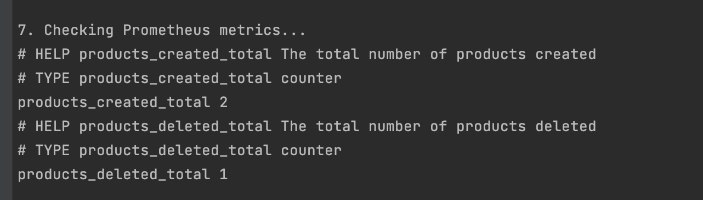
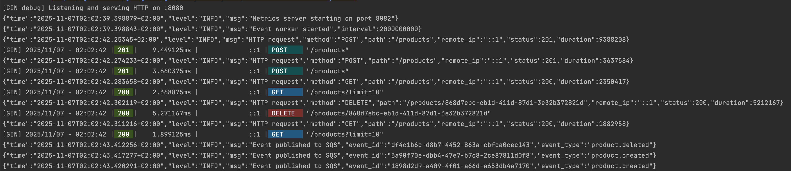
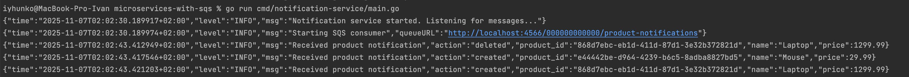

# Microservices with SQS

This repository contains two microservices that communicate via AWS SQS:
- **product-service**: REST API for managing products
- **notification-service**: Listens to product events and logs notifications

## Architecture

- **Product Service**: Gin-based REST API with PostgreSQL backend and Prometheus metrics
- **Notification Service**: SQS consumer that processes product notifications
- **Message Broker**: AWS SQS (via LocalStack for local development)
- **Database**: PostgreSQL
- **Metrics**: Prometheus

### Outbox Pattern for Reliable Event Publishing

The product service implements the **Outbox Pattern** to ensure atomic operations between database transactions and event publishing:

1. **Transactional Integrity**: When a product is created or deleted, the operation and the corresponding event are stored in the database within the **same transaction**. This ensures that either both the product operation and the event are saved, or neither is saved if an error occurs.

2. **Event Worker**: A background worker polls the `events` table every 2 seconds to find events with `pending` status. These events are then published to AWS SQS.

3. **Event Processing**: After successfully publishing an event to SQS, the worker updates the event status to `processed`. If publishing fails, the status is updated to `failed`.

This pattern guarantees that no events are lost, even if the SQS service is temporarily unavailable, because the events are durably stored in the database and will be retried by the worker.

    
##  :heavy_exclamation_mark: :heavy_exclamation_mark: :heavy_exclamation_mark: **TEST TASK FLOW RUN AND RESULT CHECK** :heavy_exclamation_mark: :heavy_exclamation_mark: :heavy_exclamation_mark:
1. Run `make docker-compose`
2. Create queue in the LocalStack: `awslocal sqs create-queue --queue-name product-notifications`
3. Run `go run cmd/product-service/main.go`
4. Run `go run cmd/notification-service/main.go`
5. Run `sh test_api.sh` to run different requests to the product service API
:white_check_mark: **You will see notification-service responses examples:**

:white_check_mark: **And created prometheus metrics:**

:white_check_mark: **Structured logs in the product-service:**

:white_check_mark: **And events are received and logged by the notification-service:**


## Prerequisites

- Go 1.25.1+
- Docker and Docker Compose

## Getting Started

1. **Copy environment file:**
   ```bash
   cp example.env .env
   ```

2. **Start infrastructure (PostgreSQL, LocalStack, Prometheus, Grafana):**
   ```bash
   docker compose up -d
   ```

3. **Run product-service:**
   ```bash
   go run cmd/product-service/main.go
   ```

4. **Run notification-service (in another terminal):**
   ```bash
   go run cmd/notification-service/main.go
   ```

## API Endpoints

### Product Service (http://localhost:8080)

#### Create Product
```bash
curl -X POST http://localhost:8080/products \
  -H "Content-Type: application/json" \
  -d '{
    "name": "Laptop",
    "description": "High-performance laptop",
    "price": 1299.99
  }'
```

#### List Products (with pagination)
```bash
# First page
curl http://localhost:8080/products?limit=10

# Next page (use next_page_token from previous response)
curl http://localhost:8080/products?limit=10&token=<next_page_token>
```

#### Delete Product
```bash
curl -X DELETE http://localhost:8080/products/<product-id>
```

## Metrics

Prometheus metrics are available at:
```
http://localhost:8082/metrics
```

Available metrics:
- `products_created_total`: Counter for created products
- `products_deleted_total`: Counter for deleted products

## Testing

Run unit tests:
```bash
make test-unit
```

Run integration tests:
```bash
make test-integration
```

**Note:** Integration tests use [dockertest](https://github.com/ory/dockertest) to automatically spin up PostgreSQL containers. Docker must be running for integration tests to work.

Run tests with coverage:
```bash
go test -coverprofile=cover.out ./internal/...
go tool cover -html=cover.out
```

## Development

### Building Services

```bash
# Build product-service
go build -o bin/product-service cmd/product-service/main.go

# Build notification-service
go build -o bin/notification-service cmd/notification-service/main.go
```

### Linting

```bash
make lint
```

## Docker Services

- PostgreSQL: `localhost:5432`
- LocalStack (SQS): `localhost:4566`
- Prometheus: `localhost:9090`
- Grafana: `localhost:3004`

## SQS Queue

The product-notifications queue is automatically created by LocalStack on startup.

Queue URL: `http://localhost:4566/000000000000/product-notifications`
